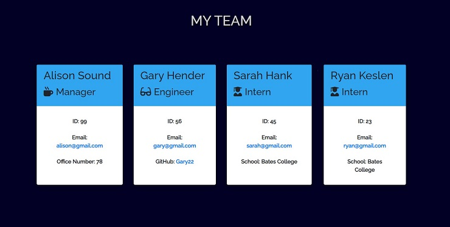

<h1 align=center>Team Generator</h1>

- Link to GitHub repository: https://github.com/Tzcodes101/teamGenerator
- Link to video walkthrough of application: https://drive.google.com/file/d/1ekicyJ2YRToc6cHEJpi4VMzduAleDSBN/view

## Description
This project is a software engineering team generator command line application that prompts a user for information about the team manager and team members. The application passes all unit tests provided with jest. When the user has completed building a team, the appliction creates an HTML file (team.html) that appealingly displays (in the browser) a corresponding team roster. 

This application functions off of inquirer prompts, asking for a manager's, engineer's, or intern's name, id, and email. A user is prompted for, when appropriate, the manager's office number, an engineer's GitHub username, or an intern's school. The user is also then able to choose which type of team member they would like to add, as well as when they are done building their team. 

Here is a screenshot of an example team-display:

## Table of Contents
- [Description](#Description)
- [Installation](#Installation)
- [Usage](#Usage)
- [Languages](#Languages)
- [License](#License)
- [Contributors](#Contributors)
- [Testing](#Testing)
- [Questions](#Questions)

## Installation
To install, a user must clone the code for the project from it's GitHub repository (https://github.com/Tzcodes101/teamGenerator) to their local workspace. The user must then run npm install inquirer, as well as jest. A user must also have node.js installed and working on their computer.

## Usage
To use this project, a user must open app.js in an integrated terminal. The user can then run node app.js, answering the questions in the terminal. Once all questions are complete, the answers will be added to the html templates, and can be opened in the browser.

## Languages
The languages and frameworks to complete this project include:
- HTML
- CSS
- Javascript
- Jest
- Inquirer

## License
 

 This application is covered by the ISC license. 

## Contributors
- Talia Zisman

## Testing
This project can be tested by following the usage instructions.

## Questions
Please e-mail the creator, Talia Zisman, of this readMeGenerator with any questions.
- E-mail: tzcodes101@gmail.com
- GitHub: [tzcodes101](http://github.com/tzcodes101)
